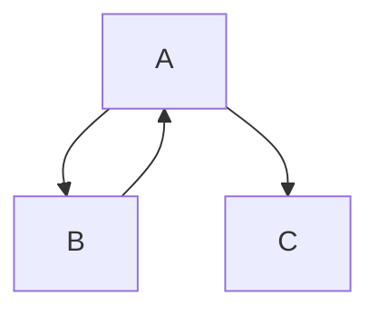
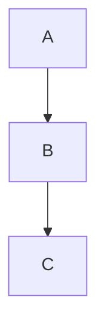

一定の規模以上のWebアプリケーションにおいて、JavaScriptを開発時のままの形で配信することは滅多にありません。[webpack](https://webpack.js.org/)や[Rollup](https://rollupjs.org/)などのバンドラを使用して、ファイルをまとめた上で配信することが一般的です。

ESModulesが普及しバンドル工程なしでも主要ブラウザがJavaScriptのモジュールを直接解釈できるようにはなりましたが、我々は依然としてバンドラを使用してWebアプリケーションを開発しています。一体なぜでしょうか？

いくつか理由はありますが、その内の1つに **`import`のコストが高い** ことがあげられます。

これはv8チームが公開している[ベンチマーク測定](https://docs.google.com/document/d/1ovo4PurT_1K4WFwN2MYmmgbLcr7v6DRQN67ESVA-wq0/pub)を見ても明らかです。モジュールの読み込みに時間がかかると当然ページの読み込み速度が遅くなり、ユーザー体験が悪化します。


出典： [ES Module loading](https://docs.google.com/document/d/1ovo4PurT_1K4WFwN2MYmmgbLcr7v6DRQN67ESVA-wq0/pub)

`import`のコストを削減するためにエコシステム側ではバンドラを用いてモジュールをまとめるという手段を提供しています。この際、ECMAScriptの振る舞いをエミュレートする方法は各バンドラによって異なります。後述する[`Top Level Await`](https://github.com/tc39/proposal-top-level-await)の扱いは非常に厄介です。

Viteのように、開発時にはESModulesをそのまま使用し、本番ビルド時にバンドルするというアプローチを取るバンドラもありますが、開発環境と本番環境で挙動が異なるという報告も何度か上がっている[^1]ようです。

そのような問題を解決するため、プラットフォーム側では[Module Declarations](https://github.com/tc39/proposal-module-declarations)という提案が進行中です。この提案は現在Stage 2で、単一ファイルで複数のモジュールを定義できるようにすることでバンドラの実装を簡素化することを目的の1つとしています。

他にもモジュール関連の提案はいくつか進行中で、それらの横断的な提案をまとめて[Module Harmony](https://docs.google.com/presentation/d/1mZrAHHimtM_z_8fM9L3DUXFz5bjlJPxx8VrwsC68hmk/edit#slide=id.p)という形で議論されています。

さて、ここで「ESModulesをそのままブラウザで使用するのはまだ難しいんだね」で終わらせてしまっても良いのですが、本記事ではそこから一歩だけ踏み込んで、ECMAScriptの仕様からESModulesでモジュールが読み込まれるまでの仕組みを理解し、さらにバンドラがESMを取り扱う上で抱える課題は何か、についてちょっとだけ考えてみたいと思います。


## Module Record

ESModulesにおける`import`の仕組みを理解するために、まずはECMAScriptの仕様に登場する[Module Record](https://tc39.es/ecma262/#sec-abstract-module-records)という概念について簡単に学習しておきましょう。

Module Recordはモジュールの読み込みや解析に必要な情報を保持するためのオブジェクトで、複数のモジュール間の依存関係を管理するために使用されます。

Module RecordにはAbstract Module Record、[Source Text Module Record](https://tc39.es/ecma262/#sec-source-text-module-records)、[Cyclic Module Record](https://tc39.es/ecma262/#sec-cyclic-module-records)の3種類があります。

**Abstract Module Record** は他のModule Recordの抽象クラスであり、Source Text Module RecordとCyclic Module Recordはそれぞれ具象クラスとして実装されています。

**Cycle Module Record** は以下のように循環依存関係を持つモジュールを表現するために使用され、サイクルを管理するために後述する`[[Status]]`フィールドに加え、`[[DFSIndex]]`や`[[DFSAncestorIndex]]`のようなフィールドを持ち、ここに必要な値を格納しながら深さ優先探索（DFS）を使用してサイクルを検出し、強連結成分（SCC）を特定します。



<div
    style={{
        height: 30
    }}
 />

```remark
辺に向きがあるグラフの事を有向グラフといいます。 <br />
強連結成分（SCC）とは、有向グラフにおいて、互いに行き来が可能な頂点の集合を指します。強連結成分内の任意の2つの頂点は、それぞれから他方に到達可能です。<br />
```


そして最後に **Source Text Module Record** ですが、これは、ECMAScriptソーステキストであるモジュールを表現するために使用されます。Source Text Module Recordは`[[ECMAScriptCode]]`フィールドを持ち、モジュールのソースコードを保持します。

そんなModule Recordですが、 **`Link`** と **`Evaluate`** というメソッドを持っています。`Link()`は依存関係の解決を行い、`Evaluate()`は解決したモジュールの実行を行うという重要な役割を担っているのですが、ここでは一旦置いておきます。これらのメソッドは後ほど登場するので頭の片隅に置いておいてください。

ただし今この時点で重要な点があります。それは、仕様上 **`Link`や`Evaluate`などのメソッドを呼び出すためには`LoadRequestedModules`というPromiseを返すメソッドの呼び出しが完了している必要がある**、ということです。

> LoadRequestedModules must have completed successfully prior to invoking this method.

`LoadRequestedModules`は依存関係グラフ内の各のModule Recordに対して、その依存関係が正しくロードされるように`[[LoadedModules]]`フィールドを満たす役割を担っています。

`[[LoadedModules]]`はSpecifier（import元[^3]）とモジュールを持つRecordのリストで、インポートするSpecifier文字列と対応するModule Recordへのマッピングを提供します。

具体的には、以下のコードにおける`./moduleA.js`がSpecifierで、`[[LoadedModules]]`フィールドにはこのSpecifierをキーとして対応するModule Recordが値として保持されます。

```js
import { something } from './moduleA.js'
```

これらを実現するために`LoadRequestedModules`はモジュールの依存関係を再帰的にロードし、終了ケースに到達するまで繰り返し呼び出された後、最終的に[`HostLoadImportedModule`](https://tc39.es/ecma262/#sec-HostLoadImportedModule)という抽象操作を実行して各Specifierに対応するModule Recordをロードします。[^4]


## HostによるModule Recordのロード

さて、ここまででModule Recordの概要と、それらのロードは`HostLoadImportedModule`という抽象操作で行われることを学びました。

ところで`HostLoadImportedModule`ですが、ECMAScript側の仕様書が示している一般的なルールや要件は存在するものの、詳細な実装が明確に定められているわけではありません。

具体的な実装は [implementation-defined](https://infra.spec.whatwg.org/#implementation-defined) であり、すなわち **その詳細な実装は各ホストの実行環境や処理系に依存します。**

今回ESMのホストはWebブラウザを想定しているため[HTML側の仕様](https://html.spec.whatwg.org/multipage/webappapis.html#hostloadimportedmodule)に従ってModulre Recordをロードすることになります。

HTML仕様の各ステップを詳細に追うことは膨大になるため省略しますが、`HostLoadImportedModule`は簡略化すると以下のような手順でモジュールをロードします。

1. モジュールの解決（Resolution）
    - [resolve a module specifier](https://html.spec.whatwg.org/multipage/webappapis.html#resolve-a-module-specifier)アルゴリズムを使用して、モジュールのspecifier（例: `./moduleA.js`）を解決し、モジュールのURLを取得します。
2. モジュールの取得（Fetching）
    - [fetch a single imported module script](https://html.spec.whatwg.org/multipage/webappapis.html#fetch-a-single-imported-module-script)アルゴリズムを使用して、前ステップで取得したURLからモジュールスクリプトを取得します。
    - 他のモジュールを読み込み中（`modulMap`が`fetching`）の際は並行で待機し、タスクキューに追加されます。
    - 取得したモジュールが **Source Text Module Record** だった場合に、**LoadRequestedModules** を呼び出して依存関係を解決します。この時、依存関係のあるモジュールも再帰的に取得されます。

これが、冒頭で述べていた`import`のコストが高い理由です。モジュールの数だけFetchが行われるため、**モジュールが増えれば増えるほど、階層が深くなれば深くなるほど読み込み時間が増加します。**

さて、前章でModuele Recordの`Link`や`Evaluate`メソッドを呼び出すためには`LoadRequestedModules`が完了している必要があると述べました。

ここでようやく、モジュールの読み込みが完了し、`Link()`が実行されます。

`Link()`はモジュールの依存関係を解決する役割を持っていて、解決したモジュールの`[[Status]]`フィールドを`LINKED`に更新します。先述の通り、Cycle Module Recordの場合は深さ優先探索（DFS）で帰りがけ順(post-order)にモジュールが訪問済みかどうか記録するために、1度目の訪問で`[[Status]]`フィールドを`LINKING`に更新します。[^5]

```remark
帰りがけ順（post-order）とは、DFSにおいて親ノードを訪問する前に子ノードを全て訪問する順序のことを指します。
走査の順番は最左端の部分木から始まり、最右端の子ノードを訪問した後に親ノードを訪問します。
```

以下は、帰りがけ順で訪問されるノードを記録するための疑似コードです。

```js
var postorderTraversal = function(root) {
    let curr = [];
    return helper(root, curr)
};

var helper = function(root, curr){
    if(root){
        helper(root.left, curr);
        helper(root.right, curr);
        curr.push(root.val);
    }
    return curr
}
```


さて、ここまででESModulesにおいてモジュールが読み込まれるまでの流れをざっくりと確認してきました。依存関係の解決が終わったら、最後に残されているのはモジュールの評価・実行です。

次章では、モジュールの評価について実際にホスト環境で動かしてみながら確認してみましょう。

## モジュールの評価

### シンプルなモジュールグラフの評価

まずは、以下のようなシンプルなケースで考えてみましょう



前章までで確認した通り、`A.Link()`が呼び出された後のモジュールA、B、C各内部ステータスは`LINKED`に設定されています。

エントリーポイントである`A.Evaluate()`が呼び出されると、依存モジュールを取得し、再帰的に[InnerModuleEvaluation](https://tc39.es/ecma262/#sec-innermoduleevaluation)を呼び出します。

この時、モジュールA、B、Cの各ステータスは以下の順序で更新されます。

1. Aの依存関係であるBの評価が開始され、`B.Evaluate()`が呼び出される
2. Bの依存関係であるCの評価が開始され、`C.Evaluate()`が呼び出される
3. Cの評価が完了し、`C.[[Status]]` = EVALUATEDに更新される
4. 次にBの評価が完了し、`B.[[Status]]` = EVALUATEDに更新される
5. 最後にAの評価が完了し、`A.[[Status]]` = EVALUATEDに更新される

図1の通り、実際にGoogle Chromeでモジュール実行を検証してみても、期待通りにモジュールが評価されていることが確認できます。


図1: モジュールA、B、Cの同期実行

<br />

### 循環参照におけるモジュールの評価

次に、循環参照を持つモジュールグラフを考えてみましょう。


この例では、モジュールAとBが互いに依存し合い、循環参照が発生しています。

[InnerModuleEvaluation](https://tc39.es/ecma262/#sec-innermoduleevaluation)の仕様において、依存関係の評価順序は以下のように定義されています。

- 依存モジュールの評価は再帰的に行われ、既に評価中のモジュールはスキップされる。
- 依存モジュールが評価を完了すると、親モジュールの評価が続行される。

> It is used by Evaluate to perform the actual evaluation process for module, as well as recursively on all other modules in the dependency graph. <br />
> If module.[[Status]] is EVALUATING, return index. <br />
> For each String required of module.[[RequestedModules]], do a. Let requiredModule be GetImportedModule(module, required). b. Set index to ? InnerModuleEvaluation(requiredModule, stack, index).

これを元に考えると、モジュールA、B、Cの各ステータスは以下の順序で更新されます。

1. Aの依存関係であるBの評価が開始され、`B.Evaluate()`が呼び出される。この時、`A.[[Status]]` = EVALUATINGに更新される。
2. Bの依存関係としてAが検出されるが、`InnerModuleEvaluation`の仕様に基づき、Aは既に評価中であるためスキップされる。
3. Bの評価が完了する。
4. 次に、Aのもう1つの依存関係であるCも同様に深さ優先探索で評価され、完了する。
5. 最後にAの評価が完了し、`A.[[Status]]` = EVALUATEDに更新される。

図2の通り、実際にGoogle Chromeでモジュール実行を検証してみても、期待通りにモジュールが評価されていることが確認できます。


図2: モジュールA、B、Cの循環参照における評価

<br />


### 非同期処理を伴う循環参照

ここまでの例では同期的な処理を前提としていましたが、ESModulesには非同期処理を伴うモジュールの評価も存在します。

そう、[Top Level Await（TLA）](https://github.com/tc39/proposal-top-level-await)です。

先ほどまでに確認した通り、ESModulesにおけるモジュールの評価・実行はDFSの帰りがけ順（post-order）で最左端の部分木から走査され、再帰的に親ノードが評価されます。

つまり、ESModulesではモジュールの評価が決定される順序は決定的（deterministic）であり、どのような試行でも同じ結果が得られることが保証されていました。

そして、TLAの世界観でもこの性質は基本的には変わりません。依存関係の評価は引き続きDFSの帰りがけ順で行われます。

ここで重要なのが、あくまで評価の実行開始順序自体は変わりませんが、TLAな処理はタスクキューに追加されるため、**モジュールの評価が完了する順序は変わる可能性がある**という点です。

以下の例を見てみましょう。
ここでは、先節で確認した循環参照を持つモジュールグラフにおいて、全てのモジュールをにTLAを含むモジュールを追加した例です。

```js
// a.mjs
console.time('a.mjs')
import  './b.mjs'
import './c.mjs'

await Promise.resolve("resolve a.mjs")

console.timeEnd('a.mjs')

// b.mjs
console.time('b.mjs')
import  './a.mjs'

await Promise.resolve("resolve b.mjs")

console.timeEnd('b.mjs')

// c.mjs
console.time('c.mjs')

await Promise.resolve("resolve c.mjs")

console.timeEnd('c.mjs')
```

この時、実行順序は前節で示したものと変わりません。ただし、`b.mjs`と`c.mjs`の評価が並行（concurrent）に行われるようになっています。


図3: モジュールA、B、Cの非同期循環参照における評価

<br />

ここで、試しに`b.mjs`のPromiseの解決を遅延させてみましょう。

```js
// b.mjs
console.time('b.mjs')
import  './a.mjs'

await new Promise(resolve => setTimeout(resolve, 0.1))

console.timeEnd('b.mjs')
```

すると、`b.mjs`の評価が遅延されるため、`c.mjs`の評価が先に完了することが確認できます。


図4: モジュールA、B、Cの非同期循環参照における評価（b.mjsの遅延）

<br />

TLAが提案された当初の仕様では、モジュールが解決する順序も従来の同期的な世界観と同じだった（つまり、b.mjsの評価を待機する仕様だった）のですが、Rollup作者のRich Harris氏による[Top-level await is a footgun](https://gist.github.com/Rich-Harris/0b6f317657f5167663b493c722647221)というGistなどをきっかけに、variant Bとして複数のTLAを並行で処理するように仕様が変更される形になったようです。

> When an asynchronous execution for a root module is fulfilled, this function determines the list of modules which are able to synchronously execute together on this completion, populating them in execList. <br />
> [Top Level Await](https://tc39.es/proposal-top-level-await/#sec-gather-async-parent-completions)

以上により、TLAな世界観においてはモジュールの解決は待機されず並行で処理され、**モジュールの評価が完了する順序は非決定的（non-deterministic）になる**ことが分かりました。

ちなみに、今回はChrome（すなわちV8エンジン）での挙動を確認しましたが、Top Level Awaitの仕様は主要ブラウザであっても完全に満たせているわけではないようです。

例えばWebKitでは、複数のモジュールが同時にTLAを含むコードをインポートして時に`ReferenceError`が起きることが報告されています[^6]。


## バンドラでのTop Level Awaitの扱い

ところで、各バンドラでTop Level Await（TLA）を含むモジュールはどのように扱われるのでしょうか。

モジュールバンドラの役割は、モジュールの依存関係を解決し、それらを1つのファイルにまとめることです（Code Splittingなどは簡単のために省略）。

そのため、TLAを含むモジュールをどうエミュレートするか、というのはバンドラの実装において重要な課題となります。

そこで本章では、各バンドラがTLAをどのように扱うか実際に検証してみましょう。

### Vite

次にViteでTLAを含むモジュールをバンドルしてみます。

今回検証に使用するViteのバージョンは`^5.3.1`です。

すると、以下のような結果が得られました。

V8で検証した挙動と異なり、Promiseの解決は並行で行われず、逐次的に処理されていることが確認できます。


図5: ViteでのTLAの結果

バンドルされたコードを見てみると、DFSの結果に応じて直列で実行されていることが確認できます。

```js
console.time("b.mjs");
await Promise.resolve("resolve b.mjs");
console.timeEnd("b.mjs");

console.time("c.mjs");
await Promise.resolve("resolve c.mjs");
console.timeEnd("c.mjs");

console.time("a.mjs");
await Promise.resolve("resolve a.mjs");
console.timeEnd("a.mjs");
```

### webpack

次に、webpackの挙動を確認してみます。

今回検証に使用するwebpackのバージョンは`^5.92.1`です。

ちなみに一点注意点として、webpackではESModulesとCommonJSの判定を[HarmonyDetectionParserPlugin](https://github.com/webpack/webpack/blob/main/lib/dependencies/HarmonyDetectionParserPlugin.js)というプラグイン行っていて、ソースファイル内の`import`や`export`の有無を元に判定しています。

なので、`import/export`文の含まれていないファイルはCommonJSとして扱われるので、そのようなファイルでTLAを使用した場合構文エラーになります。

```js
// lib/dependencies/HarmonyDetectionParserPlugin.js
if (!HarmonyExports.isEnabled(parser.state)) {
    throw new Error("Top-level-await is only supported in EcmaScript Modules");
  }
```

前章で使用した`a.js`、`b.js`、`c.js`をwebpackでバンドルし、その結果を確認してみたところ、以下のような結果が得られました。


図6: webpackでのTLAの結果

結果からわかる通り、webpackではTLAを含むモジュールを本来の操作的意味論を変えずに実行できていることが確認できます。

webpackがどのようにTLAの挙動をエミュレートしているか、バンドルされた結果から確認してみましょう。

```js
__webpack_require__.a(__webpack_module__, async (__webpack_handle_async_dependencies__, __webpack_async_result__) => { try {
    /* harmony import */ var _b_mjs__WEBPACK_IMPORTED_MODULE_0__ = __webpack_require__("./cycle/b.mjs");
    /* harmony import */ var _c_mjs__WEBPACK_IMPORTED_MODULE_1__ = __webpack_require__("./cycle/c.mjs");
    var __webpack_async_dependencies__ = __webpack_handle_async_dependencies__([_b_mjs__WEBPACK_IMPORTED_MODULE_0__, _c_mjs__WEBPACK_IMPORTED_MODULE_1__]);
    ([ _b_mjs__WEBPACK_IMPORTED_MODULE_0__, _c_mjs__WEBPACK_IMPORTED_MODULE_1__] = __webpack_async_dependencies__.then ? (await __webpack_async_dependencies__)() : __webpack_async_dependencies__);

    console.time('a.mjs');

    await Promise.resolve("resolve a.mjs");

    console.timeEnd('a.mjs');
    __webpack_async_result__();
} catch(e) { __webpack_async_result__(e); } }, 1);
```

まず初めに、`__webpack_require__`という関数が登場しました。これはモジュールをロードするための関数で、この処理は同期的に行われます。

続けてコードを見ると、`__webpack_require__.a`という関数を使用しています。この関数は、モジュールを非同期に評価するためのラッパー関数で、引数の`__webpack_handle_async_dependencies__`を用いて非同期的にモジュールをロードします。

さらに詳しく[実装](https://github.com/webpack/webpack/blob/dd44b206a9c50f4b4cb4d134e1a0bd0387b159a3/lib/runtime/AsyncModuleRuntimeModule.js#L13)を追ってみましょう。

まず、非同期モジュールの評価を待機する関数のリストをキューに保持し、非同期モジュールの評価が完了するのを待つために、Promiseを使用して評価を管理します。

```js
// 依存関係の評価が完了した際にキュー内の関数を実行する
var resolveQueue = (queue) => {
    // `queue.d`はキューが解決されたかどうかを示すフラグ。
    if(queue && queue.d < 1) {
        queue.d = 1;
        queue.forEach((fn) => (fn.r--));
        // `fn.r`は未解決の依存関係の数
        // 依存関係がまだ残っている場合はカウントを戻し、依存が全て解決された場合は関数を実行する
        queue.forEach((fn) => (fn.r-- ? fn.r++ : fn()));
    }
}

var queue;
hasAwait && ((queue = []).d = -1);
// 省略
var promise = new Promise((resolve, rej) => {
    reject = rej;
    outerResolve = resolve;
});
promise[webpackQueues] = (fn) => (queue && fn(queue), depQueues.forEach(fn), promise["catch"](x => {}));
```

次に、非同期モジュールのロードと評価の具体的なフローを見てみます。

```js
// 即時実行関数式
body((deps) => {
    currentDeps = wrapDeps(deps); // 依存関係がPromiseであるかどうかを確認し、結果を`webpackExports`に格納する
    var fn;
    var getResult = () => (currentDeps.map((d) => {
        if (d[webpackError]) throw d[webpackError];
        return d[webpackExports];
    }));
    var promise = new Promise((resolve) => {
        fn = () => (resolve(getResult));
        fn.r = 0;
        var fnQueue = (q) => (q !== queue && !depQueues.has(q) && (depQueues.add(q), q && !q.d && (fn.r++, q.push(fn))));
        currentDeps.map((dep) => (dep[webpackQueues](fnQueue)));
    });
    return fn.r ? promise : getResult();
}, (err) => ((err ? reject(promise[webpackError] = err) : outerResolve(exports)), resolveQueue(queue)));
queue && queue.d < 0 && (queue.d = 0);
```

非同期モジュールの評価が完了すると`resolveQueue`関数が呼び出され、キュー内の関数が実行されることが分かります。

この仕組みにより、webpackではTLAを含むモジュールの評価を非同期的に行うことができるようになっています。

<br />

### エコシステムの難しさ

ここまでで、ESModulesにおけるモジュールの評価の流れと、バンドラでのTop Level Await（TLA）の扱いについて確認してきました。

ちなみに、今回は循環参照を含むTLAでの挙動を確認しましたが、今の所V8/nodeの挙動を完全に再現できているバンドラは存在しません。

これはesbuild開発者の[Evan Wallace](https://github.com/evanw/tla-fuzzer)が公開している[リポジトリ](https://github.com/evanw/tla-fuzzer)からも確認できる通り、webpackでさえも循環参照を含むケースでは適応率は100%にならないようです。


図7: tla-fuzzer

## 余談

本記事ではECMAScriptとHTMLの仕様書から、ESModulesにおけるモジュールの評価の流れを追い、バンドラでのTop Level Await（TLA）の扱いについて検証してきました。

普段から私のことを知っている人にとっては、私らしくない記事だという印象を受けた方もいるかもしれません。

というのも、私はあまりプラットフォーム側の動向に関心が薄く、どちらかといえばエコシステム側で行われる技術発展に興味を持っています。

JavaScriptは元来ここまで高速に動く言語ではありませんでした。しかし、ブラウザで動く唯一の言語であるという業を背負っているため、少しでも高速化するために仕様制定者や処理系開発者だけでなく、エコシステム側の開発者も日々改善を重ねてきました。

例えば最近話題になった[React Compiler](https://react.dev/learn/react-compiler)では、コンパイルターゲットがJavaScriptであるにもかかわらず静的単一代入を用いて定数畳み込みのような最適化を施しています。

私は、そんなエコシステムの営みが好きです。ただ最近は、ユーザー側でより良い方向にJavaScriptエコシステムを発展させていくためには、仕様を理解しJavaScriptの現在地点を把握することも重要なのかもしれないと考えるようになりました。

そういう経緯で今回頑張って仕様書を読んでみて、エコシステムとプラットフォーム両方の観点からJavaScriptの世界を見てみました。疲れてきたので今日はこの辺で。


[^1]: [requires to access .default after build while it's not required in dev (CJS dependency)](https://github.com/vitejs/vite/issues/2139)

[^3]: ECMASCriptでは厳密には`ModuleSpecifier`と呼ぶが、簡単のために単に`Specifier`と表記しています。Node.jsにおいては`ImportSpecifier`が同様の定義を持ちます。

[^4]: 実際にはさらに内部関数である[InnerModuleLoading](https://tc39.es/ecma262/#sec-InnerModuleLoading)内で行われます。

[^5]: 実際の走査はより複雑ですが、さらに詳しく知りたい方は仕様書の[InnerModuleLinking](https://tc39.es/ecma262/#sec-InnerModuleLinking)より詳細を確認してください。

[^6]: [`[JSC] ReferenceError when multiple modules are simultaneously importing a module containing a top-level await`](https://bugs.webkit.org/show_bug.cgi?id=242740)